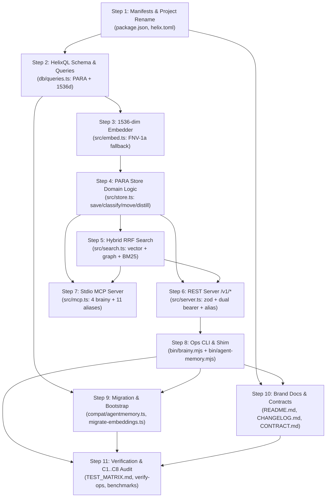

# Implementation Plan: Brainy Architecture Initiative (SPEC-001 / SPEC-002 / SPEC-003)

**Agent:** general(vasquez) — Engineering Owner (R1, execute-spec lane)  
**Date:** 2026-09-25  
**Approved By:** 
- Engineering Owner: `general(vasquez)` (R1) — [ARCHITECTURE_REVIEW.md Approved + ADR-0002 Accepted](file:///mnt/DATA/GitHub/agent-memory/docs/specs/40_workspace/engineering/ARCHITECTURE_REVIEW.md)
- Security Owner: `general(barrera)` (R2) — [SECURITY_REVIEW.md Conditional C1–C8](file:///mnt/DATA/GitHub/agent-memory/docs/specs/40_workspace/engineering/SECURITY_REVIEW.md)
- Marketing & Brand Owner: `general(vera)` (R5) — [SPEC-002 Brand Proposal Approved](file:///mnt/DATA/GitHub/agent-memory/docs/specs/40_workspace/brand/PROPOSED_CHANGES.md)
- Automation & Ops Owner: `general(espinoza)` (R8) — [SPEC-003 Ops Proposal Approved](file:///mnt/DATA/GitHub/agent-memory/docs/specs/40_workspace/automation/PROPOSED_CHANGES.md)
- Legal & Privacy Owner: `general(subero)` (R4) — [SPEC-005 Ley 172-13 Privacy Approved](file:///mnt/DATA/GitHub/agent-memory/docs/specs/20_backlog/SPEC-005-brainy-legal.md)
- Orchestrator Packet: `SPEC:docs/specs/20_backlog/SPEC-001-brainy-engineering.md#REQ-BRAINY-ENG-01..12+NFR-01..04 / HARD:subagents+max2lanes+zero-new-deps+no-secrets+alias1version+storage=disk / GATE:ARCH-Approved(ADR-0002)+SEC-Conditional(C1..C8) / DOMAINS:R1,R5,R8,R2,R4`

**Domains-Touched:** 
- Engineering (R1, owner) — HelixQL schema, 1536-dim embeddings, PARA domain logic, hybrid RRF search, REST v1, MCP server, compat
- Marketing & Brand (R5) — atomic product rename, README rewrite, developer examples, CHANGELOG breaking change entry, deprecation policy
- Automation & Ops (R8) — operational CLI `bin/brainy.mjs`, dual-bin shim, slot math, doctor precedence, never-kill invariants
- Security (R2) — C1..C8 security conditions, STRIDE threat mitigations, secret isolation, doctor probe protection, 0700/0600 permissions
- Legal & Privacy (R4) — Dominican Republic Ley 172-13 data minimization, purpose limitation, 365-day TTL, right to erasure

**Prior plan content:** The SPEC-P4-OPS ops control plane plan (2026-09-24), REQ-RL-001 + REQ-F-01 residual-closure plan (2026-09-23), and earlier plans (P0..P3) are replaced in place per the lane-singleton rule; full text and evidence logs are preserved in git history (`git log -p -- IMPLEMENTATION_PLAN.md`).

---

## Executive Summary & Initiative Scope

This master implementation plan establishes the engineering execution blueprint for **Brainy v1**, transforming the repository from an ephemeral agent session memory store (`agent-memory`) into a comprehensive Personal Knowledge Management ("Segundo Cerebro") system grounded in Tiago Forte's CODE (Capture, Organize, Distill, Express) and PARA (Projects, Areas, Resources, Archives) methodologies over HelixDB.

The scope unites three approved domain proposals:
1. **Engineering (SPEC-001 / R1):** HelixQL graph schema (`Note`, `Project`, `Area`, `Resource`, `Archive` + 7 typed edges), 1536-dimensional cosine embeddings with deterministic keyless fallback, Reciprocal Rank Fusion (RRF $k=60$) hybrid search, REST `/v1/*` endpoints with a 1-version deprecated `/memory/*` alias, stdio MCP server (`McpServer(name="brainy")`) with 4 native tools and 11 legacy aliases, and SQLite migration compatibility.
2. **Brand & Marketing (SPEC-002 / R5):** Atomic product rename to **Brainy**, full rewrite of [README.md](file:///mnt/DATA/GitHub/agent-memory/README.md) with quickstarts and 3 verified examples, breaking change documentation in [CHANGELOG.md](file:///mnt/DATA/GitHub/agent-memory/CHANGELOG.md), [docs/CONTRACT.md](file:///mnt/DATA/GitHub/agent-memory/docs/CONTRACT.md) alignment, and purging historical naming debt (`agentmemory`, `iii-engine`).
3. **Automation & Ops (SPEC-003 / R8):** Authoring `bin/brainy.mjs` (Node $\ge 20$ ESM, `node:` builtins only, zero external dependencies), transforming `bin/agent-memory.mjs` into a 1-version deprecation shim, quartet slot derivation $R(N) = 3111 + 3(N-1)$ and $H(N) = 6969 + (N-1)$, 5-check doctor with precedence $5 > 4 > 3 > 1 > 0$, state file mode `0700`/`0600`, and strict preservation of the non-negotiable **never-kill** invariant for upstream ports 3111/3112/3113.

---

## Invariants & Hard Constraints

Execution is bound by the frozen constraints defined in the orchestrator packet and [ARCHITECTURE.md](file:///mnt/DATA/GitHub/agent-memory/docs/specs/10_design/ARCHITECTURE.md) (v3 / ADR-0002):
- **INV-001 (One Breaking Rename with 1-Version Alias):** Canonical identity is `brainy` across package, CLI, env vars (`BRAINY_*`), and APIs. A 1-version backwards-compatible alias window is maintained for `agent-memory` CLI, `AGENT_MEMORY_*` env vars, `/memory/*` REST routes, and `memory_*` MCP tools with stderr/header deprecation warnings.
- **INV-002 (Frozen Surfaces):** No unapproved modifications outside the declared target files. Zero modifications to `package-lock.json`. Zero new external runtime dependencies (`zero-new-deps`).
- **INV-003 (Non-Negotiable Never-Kill):** Ports 3111, 3112, and 3113 are never killed or signaled under any circumstances. Occupied ports trigger preflight startup refusal with exit 1 and the canonical two-line `neverKillHint()`. Process signaling in `stop` requires `verifyOwnedPid` (`/proc/<pid>/cmdline` contains `src/server.ts` and `cwd === ROOT`) before SIGTERM and re-verified immediately before SIGKILL.
- **INV-004 (Strict Secret & PII Hygiene):** `BRAINY_SECRET` and `AGENT_MEMORY_SECRET` are read from environment/vault only and never logged or serialized. Output channels report boolean presence flags (`bearer: armed|unset`). Output lines are sanitized to single-line bounded strings (CWE-117 protection).
- **INV-005 (Default Addresses Intact):** Slot 1 defaults remain REST 3111 and Helix 6969. Slots are pure mathematical derivations, not default mutations.
- **INV-006 (Doctor Verdicts Closed Set):** Doctor exits 0..5 with strict precedence $5 > 4 > 3 > 1 > 0$ and emits exactly one `VERDICT:` line.
- **INV-007 (State File POSIX Isolation):** State files live at `<parent-of-data-dir>/state/slot-<N>.json` with mode `0700` directory and mode `0600` file, strictly outside `HELIX_DATA_DIR`.
- **INV-008 (Fail-Closed Migration under Probe A3):** Because probe A3 confirmed Helix CLI 3.3.0 does not forward `HELIX_DATA_DIR`, `--migrate` aborts fail-closed with `MIGRATE ABORT: unsupported-runtime` without writing backups or modifying disks.
- **INV-010 (Address Isolation):** For all $N \ge 2$, quartet $\{R(N), R(N)+1, R(N)+2, H(N)\} \cap \{3111, 3112, 3113, 6969\} = \emptyset$. Reserved ports $R+1$ and $R+2$ are strictly reserved and never bound or signaled. Port 3151 is never derived as a primary REST port.
- **INV-014 (Canonical 1536-dim Embeddings):** `EMBED_DIM = 1536` is canonical for all new writes. `BRAINY_EMBED_DIM=384` is supported as a read-only fallback during the 1-version deprecation window. `writeBatch.forEachParam` with `setProperty("embedding", vector)` refreshes vector indexes.
- **INV-015 (Frozen RRF k=60 & Zero-500 Degradation):** Hybrid search fuses vector, graph, and text with constant $k=60$. Hybrid search never returns HTTP 500; source errors degrade gracefully into the `signals` array.
- **INV-016 (Single-Writer Deduplication Lock):** Single-writer FIFO dedup locking via `dedupKey = sha256(project + "\n" + normalize(content))` extends from `Memory` to `Note` entities.

---

## Steps

| Step | Description | Target / Files | Evidence Location | Est. Effort |
|:----:|-------------|----------------|-------------------|:-----------:|
| **1** | **Package Manifest & Helix Engine Project Rename** Rename package to `brainy`, update `bin` map with dual entrypoints (`brainy` primary + `agent-memory` shim), add migration scripts; rename `[project] name = "brainy"` in `helix.toml`, declare additive `[local.slot2]` table; update `plugin.json` and `mcp_config.json`. | [package.json](file:///mnt/DATA/GitHub/agent-memory/package.json), [helix.toml](file:///mnt/DATA/GitHub/agent-memory/helix.toml), [plugin.json](file:///mnt/DATA/GitHub/agent-memory/plugin.json), [mcp_config.json](file:///mnt/DATA/GitHub/agent-memory/mcp_config.json) | `git diff package.json helix.toml`, `npm run typecheck` | 1.0 h |
| **2** | **HelixQL Schema, Types, Indexes & Batch Query Builders** Expand `LABELS` (`Note`, `Project`, `Area`, `Resource`, `Archive`, compat `Agent`, `Context`) and `EDGES` (`BELONGS_TO`, `REFERENCES`, `SUPERSEDES`, `ABOUT`, `APPLIES_TO`, `CAPTURED_BY`, `RELATES_TO`); set `EMBED_DIM = 1536`; update `bootstrapIndexes()` to register $\ge 18$ indexes (1536-dim vector indexes `note_embedding`, `memory_embedding`, scoped BM25 text, unique equality); implement batch builders `saveNote`, `listNotes`, `getNoteById`, `moveNote`, `distillNote`, `forgetNote`, `searchByVector`, `searchByText`, `graphSearch`, preserving CONTRACT §0 facts and parameter binding (C8). | [db/queries.ts](file:///mnt/DATA/GitHub/agent-memory/db/queries.ts) | `npm run typecheck`, AST query unit tests, `bootstrapIndexes` log | 3.0 h |
| **3** | **1536-dim Deterministic Embedder & Fallback Pipeline** Export `EMBED_DIM = 1536`; implement remote provider routing (`Embed()` / `text-embedding-3-small`) with deterministic keyless 1536-bucket FNV-1a + golden-ratio sign bit hash fallback and L2 normalization; support `BRAINY_EMBED_DIM` env override (default 1536, fallback 384 for migration). | [src/embed.ts](file:///mnt/DATA/GitHub/agent-memory/src/embed.ts) | `src/embed.ts` unit tests (dimension verification, L2 unit norm, deterministic repeatability), `npm run typecheck` | 1.5 h |
| **4** | **PARA Store Domain Logic & Classification in HelixStore** Declare PARA TypeScript interfaces (`NoteRow`, `ParaCategory`, etc.); implement `HelixStore.saveNote` with embedding generation, automatic `classifyPara` heuristics, initial `BELONGS_TO` edge, and automatic `RELATES_TO` linking when cosine similarity $> 0.85$ (with project tenant isolation C8); implement `listNotes`, `getNoteById` (linage projection), `moveNote` (atomic drop+add under lock), `distillNote` (append-only with `SUPERSEDES` edge), `forgetNote`; preserve all `MemoryStore` and `Todo` methods. | [src/store.ts](file:///mnt/DATA/GitHub/agent-memory/src/store.ts) | `src/store.ts` unit/integration tests, classification test suite, `npm run typecheck` | 4.0 h |
| **5** | **Hybrid RRF (k=60) Retrieval Engine** Upgrade `hybridSearch` in `src/search.ts` to execute parallel fan-out over 1536-dim vector ANN search, graph traversal (`BELONGS_TO`, `REFERENCES`, `RELATES_TO` depth $\le 2$), and scoped BM25 full-text search; apply Reciprocal Rank Fusion ($k=60$ frozen); implement score sorting, tie-breaking, and fault-tolerant `signals` array (never returns HTTP 500); enforce scoped `where project` pre-filtering for p95 $< 10$ms at 10k nodes (NFR-01). | [src/search.ts](file:///mnt/DATA/GitHub/agent-memory/src/search.ts) | `src/search.ts` tests, `scripts/eval.ts` RRF ranking verification, `npm run typecheck` | 2.5 h |
| **6** | **REST /v1/* Endpoints, Zod Schemas & Legacy /memory/* Alias** Define strict zod schemas with size constraints (C4); register routes `POST /v1/notes` (201), `GET /v1/notes/:id` (200/404), `POST /v1/search` (200), `POST /v1/memory` (201 legacy compat mapping `statement` $\to$ `content`), `GET /v1/context/:project` (200), `POST /v1/link` (201 with tenant check C8); add 1-version alias interceptor for `/memory/*` emitting `X-Deprecated: use /v1/*`; implement dual-bearer auth middleware (`BRAINY_SECRET` ?? `AGENT_MEMORY_SECRET`, timingSafeEqual, C1); update port error hints referencing `BRAINY_PORT` and never-kill 3111/3112/3113. | [src/server.ts](file:///mnt/DATA/GitHub/agent-memory/src/server.ts) | REST E2E integration tests, curl probes, route table audit, `npm run typecheck` | 3.0 h |
| **7** | **Stdio MCP Server Brainy with 4 Native Tools & 11 Aliases** Initialize `McpServer({ name: "brainy", version: "1.0.0" })`; register 4 native tools: `brainy_search`, `brainy_capture`, `brainy_link`, `brainy_reality_check`; maintain 11 legacy `memory_*` aliases and 6 `memory_todo_*` tools; preserve stdio protocol purity (stdout for JSON-RPC, stderr for single-line sanitized diagnostics); validate `_meta.authorization` against `BRAINY_SECRET` ?? `AGENT_MEMORY_SECRET` (C1). | [src/mcp.ts](file:///mnt/DATA/GitHub/agent-memory/src/mcp.ts) | MCP stdio protocol handshake tests, `tools/list` schema validation, auth error handling tests | 2.5 h |
| **8** | **Ops Control Plane CLI bin/brainy.mjs & 1-Version Shim** Author canonical `bin/brainy.mjs` (Node $\ge 20$ ESM, `node:` builtins only, zero external deps) with subcommands `add`, `move`, `distill`, `context`, `export`, `search`, `start`, `stop`, `status`, `doctor`; implement slot math $R(N) = 3111 + 3(N-1)$, $H(N) = 6969 + (N-1)$, reserved $R+1/R+2$ never-bind, `NEVER_BIND = [3111, 3112, 3113, 3151, 6969]`; preflight occupant refusal exit 1 + `neverKillHint()`; process signaling with `verifyOwnedPid` before SIGTERM and re-verified before SIGKILL (C6); state files mode `0700`/`0600` outside `HELIX_DATA_DIR` (C7); doctor 5 checks in sequence `C1→C3→C2→C4→C5` with precedence $5 > 4 > 3 > 1 > 0$ and single `VERDICT:` line (C3); fail-closed `--migrate` abort (`MIGRATE ABORT: unsupported-runtime`); transform `bin/agent-memory.mjs` into 1-version shim with stderr warning. | [bin/brainy.mjs](file:///mnt/DATA/GitHub/agent-memory/bin/brainy.mjs), [bin/agent-memory.mjs](file:///mnt/DATA/GitHub/agent-memory/bin/agent-memory.mjs) | `scripts/verify-ops.ts` execution, CLI invocation tests, slot allocation proofs | 3.5 h |
| **9** | **Operational Scripts & Compatibility Layers** Create `src/compat/agentmemory.ts` implementing SQLite to HelixDB migration conforming to PRD §7.2; create `scripts/migrate-embeddings.ts` for batched re-embedding of 384-dim records using `writeBatch.forEachParam` with `setProperty("embedding", vector)` without downtime (INV-014); update `scripts/bootstrap.ts` to resolve `BRAINY_URL` ?? `HELIX_URL`, register $\ge 18$ indexes, and execute 30s async poll loop until `index_not_found` clears; update `scripts/import-transcript.ts` with `BRAINY_*` env resolution and Ley 172-13 privacy invariants (C5). | [src/compat/agentmemory.ts](file:///mnt/DATA/GitHub/agent-memory/src/compat/agentmemory.ts), [scripts/migrate-embeddings.ts](file:///mnt/DATA/GitHub/agent-memory/scripts/migrate-embeddings.ts), [scripts/bootstrap.ts](file:///mnt/DATA/GitHub/agent-memory/scripts/bootstrap.ts), [scripts/import-transcript.ts](file:///mnt/DATA/GitHub/agent-memory/scripts/import-transcript.ts) | SQLite migration roundtrip tests, batch embedding migration verification, bootstrap async poll logs | 2.5 h |
| **10** | **Brand Documentation & Frozen Contract Updates** Rewrite `README.md` under brand Brainy (hero, quickstart, 3 verified developer examples, migration guide, `BRAINY_*` env table with legacy aliases, Ley 172-13 declaration, placeholder hygiene C2); add `## [v1.0.0] / [brainy v1]` breaking change entry in `CHANGELOG.md`; update `docs/CONTRACT.md` header to `Brainy — v1 Frozen Contract` and sweep active docs to purge `agentmemory` and `iii-engine` debt outside compat (REQ-02); author deprecation policy and launch campaign briefs. | [README.md](file:///mnt/DATA/GitHub/agent-memory/README.md), [CHANGELOG.md](file:///mnt/DATA/GitHub/agent-memory/CHANGELOG.md), [docs/CONTRACT.md](file:///mnt/DATA/GitHub/agent-memory/docs/CONTRACT.md), [policies/brand-deprecation-policy.md](file:///mnt/DATA/GitHub/agent-memory/policies/brand-deprecation-policy.md), [campaigns/brainy-v1-launch.md](file:///mnt/DATA/GitHub/agent-memory/campaigns/brainy-v1-launch.md) | `git diff`, `grep -ri "agentmemory\|iii-engine"` zero hit check, Markdown validation | 2.0 h |
| **11** | **Verification Suites, TEST_MATRIX.md & Security C1..C8 Audit** Update `scripts/verify-ops.ts` (test `bin/brainy.mjs`, shim stderr warning, slots 1..20, preflight refusal, 0700/0600 permissions, doctor precedence, foreign listener zero auth C3, migrate abort); run complete regression and verification bar: `npm run typecheck`, `npx tsx scripts/verify-ops.ts`, `npm run verify-lifecycle`, `npm run verify` against server on port 3151; measure retrieval latency benchmark (p95 $< 10$ms at 10k nodes) in `docs/benchmarks/SCORECARD.md`; update singleton `TEST_MATRIX.md` with complete `## Brainy v1` requirement traceability; compile Security C1..C8 audit proof table. | [TEST_MATRIX.md](file:///mnt/DATA/GitHub/agent-memory/TEST_MATRIX.md), [scripts/verify-ops.ts](file:///mnt/DATA/GitHub/agent-memory/scripts/verify-ops.ts), [docs/benchmarks/SCORECARD.md](file:///mnt/DATA/GitHub/agent-memory/docs/benchmarks/SCORECARD.md) | Test execution logs, typecheck logs, benchmark scorecard, Security C1..C8 evidence table | 3.5 h |

**Total Estimated Effort:** ~29.5 hours.  
Each step maps to one atomic Conventional Commit linking `REQ-ID → test → artifact`.

---

## Detailed Step-by-Step Breakdown

### Step 1: Package Manifest & Helix Engine Project Rename
- **Context & Goal:** Establish the canonical package identity `brainy` across core configuration files while wiring dual-binary execution and operational scripts.
- **Actions:**
  1. `package.json`: Update `"name": "brainy"`, `"description": "Segundo cerebro aumentado con agentes (CODE/PARA sobre HelixDB unificado)"`, bump version to `"1.0.0"`.
  2. `package.json`: Configure `"bin"` map to provide `"brainy": "./bin/brainy.mjs"` as canonical primary and `"agent-memory": "./bin/agent-memory.mjs"` as backwards-compatible alias. Add `"migrate-embeddings": "tsx scripts/migrate-embeddings.ts"`.
  3. `helix.toml`: Update `[project] name = "brainy"` (line 2). Preserve container runtime (`docker`), image (`ghcr.io/helixdb/helixdb:v0.0.6`), and dev port `6969`. Add additive table `[local.slot2]` with `port = 6970` and `storage = "disk"`.
  4. `plugin.json` & `mcp_config.json`: Update metadata keys from `agent-memory` to `brainy`.
- **Traceability:** REQ-BRAINY-ENG-01, REQ-BRAINY-MKT-01, REQ-BRAINY-OPS-01; AC-01.

### Step 2: HelixQL Schema, Types, Indexes & Batch Query Builders
- **Context & Goal:** Upgrade the database contract in `db/queries.ts` to support CODE/PARA entities, 1536-dim vector embeddings, and typed graph relations without breaking existing memory clients.
- **Actions:**
  1. Labels & Edges: Add `Note`, `Project`, `Area`, `Resource`, `Archive`, `Agent`, `Context` to `LABELS`. Add `BELONGS_TO`, `REFERENCES`, `SUPERSEDES`, `ABOUT`, `APPLIES_TO`, `CAPTURED_BY`, `RELATES_TO` to `EDGES`. Retain compat labels and `HAS_CONCEPT`.
  2. Embeddings: Update constant `EMBED_DIM = 1536`.
  3. `bootstrapIndexes()`: Define write batch registering $\ge 18$ indexes:
     - Vector: `note_embedding ON Note(embedding) 1536 cosine tenant project`, `memory_embedding ON Memory(embedding) 1536 cosine tenant project`.
     - Scoped Text: `Note.content`, `Memory.statement`, `Todo.title` on tenant `project`.
     - Unique Equality: `Note.id`, `Project.name`, `Area.name`, `Resource.name`, `Archive.name`, `Agent.name`, `Context.name`, `Memory.memoryId`, `Session.sessionId`, `Concept.name`, `Todo.todoId`.
     - Tenant Equality: `project` on all relevant node labels.
  4. Query Builders: Implement typed batch builders using `defineParams` + `PropertyInput.param` (C8): `saveNote`, `listNotes`, `getNoteById`, `moveNote`, `distillNote`, `forgetNote`, `searchByVector`, `searchByText`, `graphSearch` (traversing `BELONGS_TO`, `REFERENCES`, `RELATES_TO`), `migrateAgentMemoryRow`.
  5. Invariants: Enforce CONTRACT §0 facts: `writeBatch().forEachParam(empty)` safe, `NodeRef.var("outer")`, `varAsIf`, scoped `where project` before search, `embedding` never returned in search payload.
- **Traceability:** REQ-BRAINY-ENG-03, REQ-BRAINY-ENG-04; AC-03, AC-04; Security Condition C8.

### Step 3: 1536-dim Deterministic Embedder & Fallback Pipeline
- **Context & Goal:** Upgrade the vector embedding pipeline in `src/embed.ts` from 384 to 1536 dimensions, enabling high-dimensional semantic search while maintaining deterministic, keyless offline testability.
- **Actions:**
  1. Dimensions: Update exported constant `EMBED_DIM = 1536`.
  2. Remote Provider Routing: When remote provider or HelixDB `Embed()` is active, route text embeddings through standard 1536-dim model (`text-embedding-3-small`).
  3. Keyless Fallback Algorithm: Implement deterministic 1536-bucket hash embedding combining FNV-1a hashing with golden-ratio sign bit distribution, producing normalized float vectors ($||v||_2 = 1.0$) across 1536 dimensions.
  4. Migration Support: Inspect `BRAINY_EMBED_DIM` env variable. Default to 1536; allow fallback to 384 for legacy reading during migration.
- **Traceability:** REQ-BRAINY-ENG-04, NFR-BRAINY-ENG-03; AC-04, AC-NFR03; INV-014.

### Step 4: PARA Store Domain Logic & Classification in HelixStore
- **Context & Goal:** Implement second-brain domain logic in `src/store.ts`, uniting note capture, automatic PARA classification, note movements, progressive distillation, and semantic linking.
- **Actions:**
  1. Models: Define TypeScript types for PARA entities (`NoteRow`, `ProjectRow`, `AreaRow`, `ResourceRow`, `ArchiveRow`, `ParaCategory`, input types).
  2. `saveNote()`: Compute 1536-dim embedding via `embed()`. Evaluate `classifyPara()` heuristics (analyzing title, content keywords, and tags) to assign initial `BELONGS_TO` edge. Query candidate notes within the same project; if cosine similarity $> 0.85$, create automatic `RELATES_TO` edges under tenant verification (C8).
  3. `listNotes()` & `getNoteById()`: Read notes with project scoping; project attached PARA category and historical distillation lineage (`SUPERSEDES`, `supersededBy`).
  4. `moveNote()`: Atomic drop of previous `BELONGS_TO` edge and creation of new `BELONGS_TO` edge to target PARA node under `noteId` lock.
  5. `distillNote()`: Append new summary `Note` node with directed `SUPERSEDES` edge to predecessor. Content is never mutated in place (immutable provenance).
  6. `forgetNote()`: Permanent deletion conforming to Ley 172-13 right to erasure.
  7. Preserve backward compatibility: retain all existing `MemoryStore` methods and single-writer FIFO deduplication locks (`INV-016`).
- **Traceability:** REQ-BRAINY-ENG-05, REQ-BRAINY-ENG-06, REQ-BRAINY-ENG-07; AC-05, AC-06, AC-07; Security Conditions C4, C5, C8.

### Step 5: Hybrid RRF (k=60) Retrieval Engine
- **Context & Goal:** Implement the unified hybrid retrieval engine in `src/search.ts` fusing vector ANN similarity, graph traversal, and BM25 text search via Reciprocal Rank Fusion.
- **Actions:**
  1. Parallel Fan-out: Execute parallel queries across:
     - 1536-dim vector ANN search on `Note` and `Memory` (`vectorSearchWith` scoped by `project` tenant).
     - Scoped BM25 full-text search on `Note.content` and `Memory.statement`.
     - Graph relationship traversal across `BELONGS_TO`, `REFERENCES`, and `RELATES_TO` edges up to `max_depth` (default 2).
  2. RRF Fusion: Fuse ranks using frozen formula: $score = \sum \frac{1}{60 + rank_i}$ ($k = 60$ frozen per INV-015).
  3. Deterministic Sorting: Sort results by `score desc → updatedAt desc → id asc`.
  4. Fault-Tolerant Signals: Catch upstream source drops; append diagnostic warnings to `signals` array (`"vector: ..."`). Never return HTTP 500 on partial source failure.
  5. Performance Optimization: Enforce scoped `where project` pre-filters and strict query limits (`limit ≤ 100`, `max_depth ≤ 3`, `vector_top_k ≤ 20`) to guarantee p95 $< 10$ms at 10k nodes (NFR-01).
- **Traceability:** REQ-BRAINY-ENG-09, NFR-BRAINY-ENG-01; AC-09, AC-NFR01; INV-015.

### Step 6: REST /v1/* Endpoints, Zod Schemas & Legacy /memory/* Alias
- **Context & Goal:** Expand the HTTP REST daemon in `src/server.ts` with canonical `/v1/*` routes, strict input validation, dual-bearer authentication, and a 1-version deprecated legacy alias.
- **Actions:**
  1. Zod Schemas: Define strict validation schemas (`createNoteBodySchema`, `updateNoteBodySchema`, `searchNotesQuerySchema`, `linkNodesBodySchema`, `contextQuerySchema`). Enforce `strict()` to reject unknown fields (C4). Enforce body size cap at 1 MiB (HTTP 413) and string length bounds (`content` $\le 200,000$, `title` $\le 500$, `query` $\le 10,000$).
  2. Route Table: Register `POST /v1/notes` (201), `GET /v1/notes/:id` (200/404), `POST /v1/search` (200), `POST /v1/memory` (201 legacy compat mapping `statement` $\to$ `content`), `GET /v1/context/:project` (200), `POST /v1/link` (201 with tenant verification C8).
  3. Legacy Route Alias: Intercept `/memory/*` requests before auth guard; rewrite to canonical paths with HTTP response header `X-Deprecated: use /v1/*`.
  4. Dual-Bearer Auth Middleware: Resolve `BRAINY_SECRET`, falling back to `AGENT_MEMORY_SECRET` with stderr deprecation warning. Validate via `crypto.timingSafeEqual`. Exempt only `/livez` and `/memory/livez`. Emit `WARN INSECURE` if listening on non-loopback host with unset secret (C1).
  5. Port Conflict Hint: Update `portInUseHint()` referencing `BRAINY_PORT=3151` and strictly preserving non-negotiable instruction: `"if upstream agentmemory holds 3111/3112/3113, NEVER kill it"`.
- **Traceability:** REQ-BRAINY-ENG-12, REQ-BRAINY-SEC-01; AC-12; Security Conditions C1, C4, C6, C8.

### Step 7: Stdio MCP Server Brainy with 4 Native Tools & 11 Aliases
- **Context & Goal:** Upgrade the stdio Model Context Protocol server in `src/mcp.ts` to represent Brainy v1, exposing native second-brain tools alongside backwards-compatible memory aliases.
- **Actions:**
  1. Initialization: Rename server instance to `McpServer({ name: "brainy", version: "1.0.0" })`.
  2. 4 Native Tools: Register via `registerTools`:
     - `brainy_search`: Hybrid retrieval over 1536-dim vector, graph, and BM25 with RRF scoring.
     - `brainy_capture`: Fast capture with automatic PARA classification and `RELATES_TO` linking.
     - `brainy_link`: Explicit graph edge creation (`REFERENCES`, `BELONGS_TO`, `RELATES_TO`).
     - `brainy_reality_check`: Grounding tool retrieving active project rules, conventions, and notes.
  3. Legacy Aliases: Retain 11 `memory_*` tools and 6 `memory_todo_*` tools delegating to store methods with deprecation annotations.
  4. Protocol Hygiene: Maintain absolute stdout purity (JSON-RPC protocol only). Route all operational diagnostics to stderr using single-line sanitized logging (`logSafeNote`).
  5. Security Gate: Validate `extra._meta.authorization` against `BRAINY_SECRET` ?? `AGENT_MEMORY_SECRET` via `isMetaAuthorized` (C1).
- **Traceability:** REQ-BRAINY-ENG-10, REQ-BRAINY-SEC-01; AC-10; Security Condition C1.

### Step 8: Ops Control Plane CLI bin/brainy.mjs & 1-Version Shim
- **Context & Goal:** Author the canonical standalone operational control plane `bin/brainy.mjs` and transform `bin/agent-memory.mjs` into a 1-version deprecation shim under strict process safety.
- **Actions:**
  1. Standalone CLI `bin/brainy.mjs`: Authored in Node $\ge 20$ ESM using `node:` builtins only (zero external deps per INV-001). Subcommands: `add`, `move`, `distill`, `context`, `export`, `search`, `start`, `stop`, `status`, `doctor`.
  2. Slot Math: Implement pure formulas $R(N) = 3111 + 3(N-1)$ and $H(N) = 6969 + (N-1)$. Enforce reserved ports $R+1$ and $R+2$ are never bound and never signaled. Maintain `NEVER_BIND = [3111, 3112, 3113, 3151, 6969]`.
  3. Preflight Safety: Inspect quartet ports; refuse foreign occupants with exit 1 and the canonical two-line `neverKillHint()`.
  4. Process Termination: Implement `stop` with `verifyOwnedPid` (`/proc/<pid>/cmdline` contains `src/server.ts` and `cwd === ROOT`) verified before SIGTERM and re-verified immediately before SIGKILL (C6 / S-010).
  5. State Management: Store state at `<parent-of-data-dir>/state/slot-<N>.json` with mode `0700` dir and mode `0600` file, closed JSON schema, strictly outside `HELIX_DATA_DIR` (C7). Log lifecycle actions to `state/audit.log` (mode `0600`).
  6. Doctor Command: Execute 5 checks in canonical sequence `C1 helix-healthz → C3 ports → C2 rest-health → C4 secret-presence → C5 storage-data-dir` with strict exit precedence $5 > 4 > 3 > 1 > 0$ and single terminal `VERDICT:` line. C2 health probe is gated behind proven port ownership in C3 (zero auth sent to foreign listeners C3).
  7. Fail-Closed Migration: On `--migrate`, abort immediately with `MIGRATE ABORT: unsupported-runtime` per probe A3 without disk modification.
  8. Deprecation Shim: Transform `bin/agent-memory.mjs` to emit `WARN deprecated use brainy — agent-memory alias will be removed in next major` on stderr and delegate arguments to `bin/brainy.mjs` with matching exit codes.
- **Traceability:** REQ-BRAINY-OPS-01..06; NFR-BRAINY-OPS-01; Security Conditions C3, C6, C7; Invariants INV-001, INV-003, INV-006, INV-007, INV-008, INV-010.

### Step 9: Operational Scripts & Compatibility Layers
- **Context & Goal:** Provide verified migration paths from legacy SQLite databases, batched vector dimension migration, and reliable async index bootstrapping.
- **Actions:**
  1. `src/compat/agentmemory.ts`: Implement SQLite to HelixDB migration conforming to PRD §7.2 mapping table (`memories.statement` $\to$ `Memory.statement`, `objects.name` $\to$ `Resource.name`, `links.about` $\to$ `E::ABOUT`, `links.context` $\to$ `E::APPLIES_TO`). Implement idempotent batched insertion with deduplication.
  2. `scripts/migrate-embeddings.ts`: Author batch migration script scanning existing 384-dim records, generating 1536-dim embeddings via `embed()`, and updating records in batches using `writeBatch.forEachParam` with `setProperty("embedding", vector)` without service downtime (INV-014).
  3. `scripts/bootstrap.ts`: Update environment resolution to read `BRAINY_URL` ?? `HELIX_URL`. Call `bootstrapIndexes()` registering $\ge 18$ indexes. Execute async poll loop probing BM25 and vector readiness every 2s up to 30s until `index_not_found` clears. Print `READY — Brainy indexes verified`.
  4. `scripts/import-transcript.ts`: Update URL and auth resolution to `BRAINY_*` with `AGENT_MEMORY_*` fallbacks. Enforce Ley 172-13 privacy invariants by omitting prompt text unless `--include-prompts` is explicitly set (C5).
- **Traceability:** REQ-BRAINY-ENG-04, REQ-BRAINY-ENG-11, NFR-BRAINY-ENG-02, NFR-BRAINY-ENG-03; AC-04, AC-11, AC-NFR02, AC-NFR03; Security Condition C5.

### Step 10: Brand Documentation & Frozen Contract Updates
- **Context & Goal:** Establish authoritative public documentation, developer quickstarts, breaking change communications, and frozen contract alignment under brand Brainy.
- **Actions:**
  1. `README.md`: Complete rewrite positioning Brainy as "segundo cerebro aumentado con agentes" (CODE/PARA sobre HelixDB unificado). Provide CLI quickstart (`helix start dev`, `npm run bootstrap`, `brainy add`, `brainy search`, `brainy context`). Include 3 copyable developer examples (`brainy add` / `POST /v1/notes`, hybrid search with RRF scores via `brainy_search`, Obsidian markdown export via `brainy export`). Feature "Migration from agent-memory" section detailing 1-version alias window and port preservation. Include complete `BRAINY_*` environment table. Declare Ley 172-13 privacy posture and maintain strict placeholder hygiene (`BRAINY_SECRET=***`, `$BRAINY_SECRET` C2).
  2. `CHANGELOG.md`: Author breaking change entry under Keep a Changelog: `## [v1.0.0] / [brainy v1]` documenting entity renames, 1-version alias window, stderr deprecation warning format, sunset milestone (v2.0.0), SQLite migration, and secret posture.
  3. `docs/CONTRACT.md`: Update header to `Brainy — v1 Frozen Contract`; update all body references to Brainy while freezing compatibility appendix (`brainy.compat.agentmemory` mapping, legacy `/v1/memory` payload).
  4. Brand Debt Purge: Sweep active documentation and skill definitions to eliminate all non-compat occurrences of `agentmemory` and `iii-engine` (REQ-02).
  5. Policy & Campaigns: Author [policies/brand-deprecation-policy.md](file:///mnt/DATA/GitHub/agent-memory/policies/brand-deprecation-policy.md) and [campaigns/brainy-v1-launch.md](file:///mnt/DATA/GitHub/agent-memory/campaigns/brainy-v1-launch.md).
- **Traceability:** REQ-BRAINY-MKT-01..07, REQ-BRAINY-ENG-02; AC-01, AC-02, AC-04, AC-05, AC-06, AC-07; Security Condition C2.

### Step 11: Verification Suites, TEST_MATRIX.md & Security C1..C8 Audit
- **Context & Goal:** Execute comprehensive test suites, produce empirical benchmark evidence, update singleton test matrix, and audit compliance against Security Conditions C1..C8.
- **Actions:**
  1. Update `scripts/verify-ops.ts`: Target `bin/brainy.mjs` as primary executable; validate `bin/agent-memory.mjs` stderr deprecation notice; verify slot math $R(N)$ and $H(N)$ across slots 1..20; verify preflight foreign occupant refusal exit 1 + `neverKillHint()`; prove foreign processes holding ports survive `start`, `stop`, `status`, `doctor` intact; verify state file mode `0700`/`0600`; verify doctor 5 checks and precedence $5 > 4 > 3 > 1 > 0$; verify synthetic secret masking; verify `--migrate` fail-closed abort; verify C1 foreign-listener zero Authorization header proof (C3).
  2. Execute Verification Bar:
     - `npm run typecheck` (0 errors).
     - `npx tsx scripts/verify-ops.ts` (all sections green).
     - `npm run verify-lifecycle` (all lifecycle invariants green).
     - `npm run verify` against server on port 3151 (all regression and new feature tests green).
  3. Retrieval Performance Benchmark: Execute `scripts/eval.ts` on 10k nodes; verify hybrid search p95 $< 10$ms; record metrics (R@5, MRR, nDCG, p95 latency) in `docs/benchmarks/SCORECARD.md` (NFR-01).
  4. Singleton `TEST_MATRIX.md`: Add `## Brainy v1 (SPEC-001 / SPEC-002 / SPEC-003)` section mapping every requirement (`REQ-BRAINY-ENG-01..12`, `REQ-BRAINY-MKT-01..07`, `REQ-BRAINY-OPS-01..06`, `NFR-01..04`) to test identifiers, evidence locations, and commit hashes.
  5. Security C1..C8 Audit Table: Author verification matrix confirming proof of satisfaction for each security condition.
- **Traceability:** NFR-BRAINY-ENG-01..04; AC-NFR01..NFR04; Security Conditions C1..C8; Verification Gate.

---

## Order of Operations & Architectural Grounding

The execution sequence is structured to respect strict architectural dependencies, ensuring that each step builds upon verified foundations:

### Dependency Rationale:
1. **Manifests First (Step 1):** Renaming the project in `helix.toml` and `package.json` configures the underlying engine and toolchains before schema application.
2. **Schema & Types Before Store (Step 2 $\to$ Step 3 $\to$ Step 4):** `HelixStore` requires the typed AST builders, parameter sets, and 1536-dim indexes from `db/queries.ts`, as well as the embedding generation function from `src/embed.ts`.
3. **Store Before Search (Step 4 $\to$ Step 5):** Hybrid search relies on `HelixStore` and query definitions to traverse graph edges and fetch hydrated note content.
4. **Core Engines Before Protocols (Steps 4 & 5 $\to$ Steps 6 & 7):** Both REST `/v1/*` and MCP stdio protocols wrap the store and retrieval engines. Exposing them after store and search are tested prevents interface churn.
5. **Server Before CLI Lifecycle (Step 6 $\to$ Step 8):** `bin/brainy.mjs` spawns `src/server.ts` and probes its readiness endpoints (`/v1/livez` and `/memory/livez`); the server must support the derived environment variables and routes.
6. **Operations Before Migration Scripts (Step 8 $\to$ Step 9):** Migration and bootstrap scripts utilize the CLI configuration, port conventions, and database bindings established in Steps 2 and 8.
7. **Implementation Before Brand Documentation (Steps 1–9 $\to$ Step 10):** Authoring verified documentation and copyable examples requires exact knowledge of the implemented CLI commands, REST routes, and environment variable names.
8. **Verification & Audit Last (Steps 1–10 $\to$ Step 11):** Comprehensive test suites, benchmark scorecards, and security audit proofs must run against the fully assembled and integrated codebase.

---

## Rollback Points

To ensure zero downtime, deterministic recovery, and safe reversal in the event of unexpected issues, three distinct rollback levels are defined:

### 1. Code Revert (Owner: `general(vasquez)` R1 — ETA $< 15$ min)
- **Mechanism:** Execute clean git reversal of implementation commits via `git revert <commit-hashes>` in reverse order.
- **Scope:** Reverts `src/**`, `db/**`, `bin/**`, `scripts/**`, and documentation files to the pre-initiative baseline.
- **Safety Proof:** Because the change introduces zero new external runtime dependencies (`zero-new-deps`), running `npm run typecheck` and `npm run verify` immediately confirms post-revert integrity.

### 2. Data Rollback & Storage Restore (Owner: `general(vasquez)` R1 / `general(espinoza)` R8 — ETA $< 20$ min)
- **Graph Nodes:** If 1536-dim schema requires retraction: drop `Note`, `Project`, `Area`, `Resource`, and `Archive` nodes. Retain existing `Memory`, `Session`, `Concept`, and `Todo` nodes intact.
- **Vector Indexes:** Re-run `scripts/bootstrap.ts` under `BRAINY_EMBED_DIM=384` to restore 384-dimensional vector indexes if necessary.
- **ACID Storage Safety:** Under `helix.toml [local.dev] storage="disk"`, the MinIO/filesystem data volume is retained intact; no data deletion or volume prune commands are executed.

### 3. Configuration & Binary Restore (Owner: `general(espinoza)` R8 / `general(vera)` R5 — ETA $< 10$ min)
- **Package Manifest:** Revert `"name"` to `"agent-memory"` in `package.json`, `helix.toml`, `plugin.json`, and `mcp_config.json`.
- **Executable Link:** Revert `"bin"` map in `package.json` to point primary execution to `bin/agent-memory.mjs`.
- **Environment Fallback:** Restore `AGENT_MEMORY_*` environment variables as primary in deployment profiles.

### 4. Process & Port Cleanup
- If a running slot process is active during rollback, execute `node bin/brainy.mjs stop --slot <N>` or `node bin/agent-memory.mjs stop --slot <N>`.
- The stop routine validates `verifyOwnedPid` and cleanly shuts down tracked child processes. Upstream ports 3111, 3112, and 3113 are never touched or signaled.

---

## Quality Gates & Security Conditions (C1..C8)

Entry into `frame-ship:quality-gate` requires satisfying all domain checks and proving compliance with Security Conditions C1..C8:

### Domain Checks Matrix

| Domain | Owner | Required Check / Evidence | Status |
|---|---|---|:---:|
| **Engineering (R1)** | `general(vasquez)` | - `npm run typecheck` clean (0 errors, strict TypeScript, zero `any`). - All unit and integration test suites passing. - Retrieval latency benchmark p95 $< 10$ms at 10k nodes in `docs/benchmarks/SCORECARD.md`. - Zero modification to `package-lock.json` and zero new runtime dependencies. | Pending Execution |
| **Security (R2)** | `general(barrera)` | - Proof of satisfaction for Security Conditions C1 through C8 (detailed below). - Clean secret scan (`gitleaks` and grep scan = 0 findings). - Constant-time bearer verification in `src/server.ts` and `src/mcp.ts`. | Pending Execution |
| **Automation & Ops (R8)** | `general(espinoza)` | - `npx tsx scripts/verify-ops.ts` all sections passing. - Slot math $R(N)$ and $H(N)$ verified across slots 1..20. - Doctor checks executed in sequence `C1→C3→C2→C4→C5` with precedence $5 > 4 > 3 > 1 > 0$. - Non-negotiable never-kill invariant proven (upstream 3111/3112/3113 never signaled). | Pending Execution |
| **Marketing & Brand (R5)** | `general(vera)` | - Complete rewrite of `README.md` with quickstart, 3 verified developer examples, and migration guide. - Breaking change entry `## [v1.0.0] / [brainy v1]` in `CHANGELOG.md`. - Zero occurrences of `agentmemory` or `iii-engine` outside compat layers (`grep` check = 0). - Zero overpromising of unbuilt roadmap features (no GUI, multi-device sync, or audio/images). | Pending Execution |
| **Legal & Privacy (R4)** | `general(subero)` | - Ley 172-13 privacy declarations: explicit purpose limitation ("segundo cerebro CODE/PARA"), 365-day TTL (`BRAINY_TTL_DAYS`), and user erasure. - Hooks and telemetry strictly omit raw user prompt text. - Apache-2.0 license notice continuity maintained. | Pending Execution |

---

### Security Conditions Verification Mapping (C1..C8)

| Condition | Requirement & Technical Control | Target File(s) | Verification Evidence |
|:---:|---|---|---|
| **[C1]** | **Bearer Guard Parity & Alias Resolution** REST `/v1/*` routes and MCP stdio tools validate `BRAINY_SECRET` with fallback to `AGENT_MEMORY_SECRET` using `crypto.timingSafeEqual`. Only `/livez` and `/memory/livez` exempt. Unset secret on non-loopback host emits `WARN INSECURE`. | `src/server.ts`, `src/auth.ts`, `src/mcp.ts` | Test asserting 401 on missing/wrong token across `/v1/*` and `/memory/*`; test asserting timingSafeEqual; log capture of non-loopback warning. |
| **[C2]** | **No Secrets in Repo & Strict Placeholder Hygiene** Literal secrets must NEVER appear in code, configuration, logs, examples, or documentation. Public guides use placeholders (`BRAINY_SECRET=***`, `$BRAINY_SECRET`). | `README.md`, `CHANGELOG.md`, `docs/**` | Pre-push `gitleaks` scan report; `grep -rn "BRAINY_SECRET="` scan showing only placeholders. |
| **[C3]** | **Doctor Probe Credential Isolation (C1→C3→C2 Ordering)** Doctor CLI subcommand executes in sequence `C1 → C3 → C2 → C4 → C5`. Check C2 NEVER transmits an `Authorization` header unless C3 verified listener ownership via `verifyOwnedPid`. `status` is naked. | `bin/brainy.mjs`, `scripts/verify-ops.ts` | Section in `scripts/verify-ops.ts` with foreign listener capturing 0 HTTP requests and 0 Authorization headers during doctor probe. |
| **[C4]** | **Strict Input Validation & DoS Caps** Inbound payloads parsed via strict zod schemas rejecting unknown fields. Maximum body size capped at 1 MiB (HTTP 413). Note content $\le 200,000$ chars, title $\le 500$ chars, query $\le 10,000$ chars. Query timeouts capped at 15s (`withTimeout`). | `src/server.ts`, `src/store.ts` | Unit tests injecting $> 1$ MiB body (expect 413), unknown fields (expect 400), $> 200$k chars (expect 400), and 15s timeout assertion. |
| **[C5]** | **Ley 172-13 PII Minimization & Store Declaration** Store declarations define purpose limitation, 365-day TTL (`BRAINY_TTL_DAYS`), and permanent erasure (`forgetNote`, `forgetMemory`). Hook captures omit user prompt text (`UserPromptSubmit` returns fixed string). Evidence masks PII. | `src/store.ts`, `hooks/capture.mjs`, `README.md` | Verification of hook payload proving prompt text omission; test proving `forgetNote` drops data permanently; masked evidence in `TEST_MATRIX.md`. |
| **[C6]** | **Never-Kill Invariant & Safe Lifecycle Signaling** Ports 3111, 3112, 3113 NEVER killed or signaled. Port collisions fail closed with exit 1 and `neverKillHint()`. Process `stop` verifies `verifyOwnedPid` before SIGTERM and re-verifies before SIGKILL. | `bin/brainy.mjs`, `src/server.ts` | `scripts/verify-ops.ts` test verifying foreign processes on quartet ports survive `start`, `stop`, `status`, and `doctor` intact. |
| **[C7]** | **State & Audit File Hardening (0700/0600 Permissions)** State directory created mode `0700` (`rwx------`), state files and audit logs created mode `0600` (`rw-------`) outside `HELIX_DATA_DIR`. Schemas strictly closed. | `bin/brainy.mjs` | `stat` mode inspection tests asserting `0700` directory and `0600` file permissions; validation test rejecting extraneous JSON keys. |
| **[C8]** | **HelixQL Parameter Binding & Tenant Isolation** All HelixQL queries use typed parameter binding (`defineParams` + `toQueryRequest`); zero string concatenation. Edge creation (`POST /v1/link`, `saveNote`) verifies both nodes belong to same `project` tenant. | `db/queries.ts`, `src/store.ts`, `src/server.ts` | AST query inspect proving zero string interpolation; test injecting cross-tenant link IDs returning HTTP 400 `invalid_tenant_link`. |

---

## Commit Strategy & REQ-ID Traceability

Each implementation step maps to an atomic Conventional Commit following the standard:
`<type>(<scope>): <description> [REQ-ID] [AC-ID]`

Planned commit sequence:
1. `chore(pkg): rename project to brainy with dual-binary and slot2 config [REQ-BRAINY-ENG-01, REQ-BRAINY-OPS-01] [AC-01]`
2. `feat(schema): expand HelixQL schema for CODE/PARA with 1536-dim indexes [REQ-BRAINY-ENG-03, REQ-BRAINY-ENG-04] [AC-03, AC-04] [C8]`
3. `feat(embed): implement 1536-dim embedder with deterministic keyless fallback [REQ-BRAINY-ENG-04, NFR-03] [AC-04, AC-NFR03]`
4. `feat(store): implement PARA domain logic, classification and distillation [REQ-BRAINY-ENG-05, REQ-BRAINY-ENG-06, REQ-BRAINY-ENG-07] [AC-05, AC-06, AC-07] [C4, C5, C8]`
5. `feat(search): implement hybrid RRF k=60 retrieval with signals envelope [REQ-BRAINY-ENG-09, NFR-01] [AC-09, AC-NFR01]`
6. `feat(server): add REST /v1/* endpoints, zod schemas and /memory/* alias [REQ-BRAINY-ENG-12, REQ-BRAINY-SEC-01] [AC-12] [C1, C4, C6, C8]`
7. `feat(mcp): implement stdio MCP Server brainy with 4 tools and 11 aliases [REQ-BRAINY-ENG-10, REQ-BRAINY-SEC-01] [AC-10] [C1]`
8. `feat(ops): author bin/brainy.mjs control plane CLI and agent-memory shim [REQ-BRAINY-OPS-01..06] [AC-OPS-01..06] [C3, C6, C7]`
9. `feat(compat): implement SQLite migration and operational scripts [REQ-BRAINY-ENG-11, NFR-02] [AC-11, AC-NFR02] [C5]`
10. `docs(brand): rewrite README for Brainy v1, update CHANGELOG and CONTRACT [REQ-BRAINY-MKT-01..07, REQ-BRAINY-ENG-02] [AC-01, AC-02, AC-05] [C2]`
11. `test(verify): expand verify-ops, benchmark scorecard and TEST_MATRIX [NFR-01..04] [AC-NFR01..NFR04] [C1..C8]`

---

## Evidence Log (Updated In Place During Implementation)

- **Probe A3 (Pre-flight):** Recorded FAIL — `helix start` CLI 3.3.0 does not forward `HELIX_DATA_DIR`. Consequence: `--migrate` fails closed with `MIGRATE ABORT: unsupported-runtime`; `--data-dir` functions as state-path input only; MinIO storage retained.
- **Architectural Approval:** ADR-0002 accepted in `docs/adr/ADR-0002-brainy-code-para-helixdb.md`.
- **Security Sign-off:** Conditional C1–C8 established in `docs/specs/40_workspace/engineering/SECURITY_REVIEW.md`.
- **Domain Proposals:** Engineering, Brand, and Automation proposals verified and reconciled in `docs/specs/40_workspace/`.
- **Next Action:** Orchestrator clears specialist dispatch for execution of Steps 1 through 11 under `frame-ship:execute-spec`.
