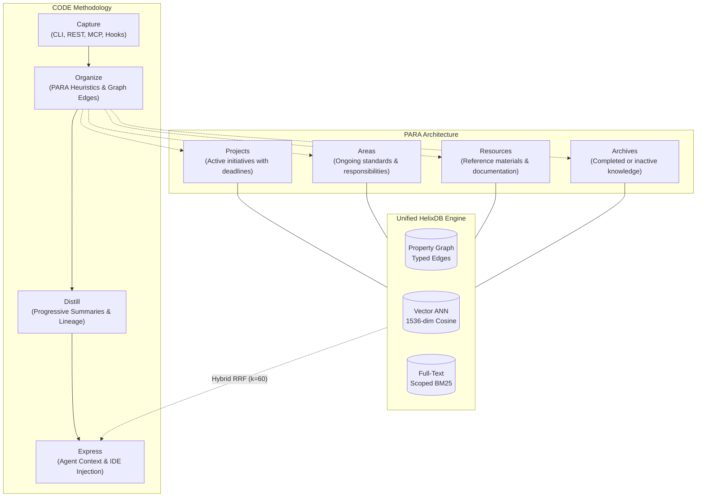

# Brainy

[](CHANGELOG.md)
[](LICENSE)
[](package.json)
[](https://docs.helix-db.com)

> **Segundo cerebro aumentado con agentes** — Sistema de gestión de conocimiento personal y persistencia contextual para agentes de desarrollo (Claude Code, Cursor, Gemini CLI, Antigravity, OpenCode), combinando la metodología **CODE/PARA** de Tiago Forte sobre el motor unificado **HelixDB** (grafo + vector + BM25 + temporal).

The authoritative frozen wire contract implemented by this repository is [`docs/CONTRACT.md`](docs/CONTRACT.md).

---

## Overview

### The Problem: Agent Amnesia & Passive Notes

AI coding agents are extraordinarily capable within a single prompt, but suffer from **session amnesia**: every new conversation starts with a blank slate, forcing developers to re-explain architectural decisions, project conventions, and environment preferences repeatedly.

Existing solutions fall into two flawed extremes:
1. **Passive PKM (Obsidian, Notion, Logseq):** Store static text without active semantic understanding, relational linking, or automated recall hooks during coding workflows.
2. **Flat Memory Stores:** Rely on primitive, unstructured key-value or session/statement tuples without hierarchical organization, progressive distillation, or relational context.

### The Solution: Brainy

**Brainy** transforms AI agents from forgetful tools into continuous collaborative partners. It implements Tiago Forte's proven **CODE** (*Capture, Organize, Distill, Express*) and **PARA** (*Projects, Areas, Resources, Archives*) frameworks directly into the developer workflow.

Powered by a single, self-hosted **HelixDB** engine, Brainy unifies:
- **Relational Graph:** Typed edges (`BELONGS_TO`, `REFERENCES`, `SUPERSEDES`, `ABOUT`, `APPLIES_TO`, `RELATES_TO`) linking notes, projects, domains, and tasks.
- **1536-Dimensional Vector Embeddings:** High-resolution semantic embeddings with deterministic keyless fallback for offline environments.
- **BM25 Full-Text Search:** Scoped, tokenized keyword search with tenant isolation.
- **Temporal Memory:** Deterministic importance decay, recall frequency boosting, and Ley 172-13 compliant 365-day TTL retention.

All retrieval operations execute locally with **sub-10ms p95 latency at 10,000 nodes** without external SaaS dependencies, cloud vector databases, or recurring API costs.

---

## How It Works

### CODE Flow & PARA Organization



### Data Model

Brainy structures knowledge using typed nodes and directional relationships:

```
Nodes:
  Note        id (unique), title, content, category (Project|Area|Resource|Archive),
              project (tenant), importance (0..1), createdAt, updatedAt,
              embedding (f32[1536]), dedupKey (unique sha256)
  Project     name (unique), project, deadline, status (active|completed)
  Area        name (unique), project, domain
  Resource    name (unique), project, sourceUrl, format
  Archive     name (unique), project, archivedAt
  Todo        todoId (unique), title, description, priority, status, project

Edges:
  BELONGS_TO   Note ──▶ Project | Area | Resource | Archive
  REFERENCES   Note ──▶ Note (explicit cross-reference)
  SUPERSEDES   Note ──▶ Note (distilled summary superseding original)
  RELATES_TO   Note ──▶ Note (automated semantic link, cosine similarity > 0.85)
  ABOUT        Note ──▶ Resource
  APPLIES_TO   Note ──▶ Area
  CAPTURED_BY  Note ──▶ Session
```

### Hybrid Retrieval Engine (RRF $k=60$)

Retrieval via `POST /v1/search` or MCP tool `brainy_search` executes parallel fan-out across three independent sources:
1. **Vector ANN:** 1536-dimensional cosine similarity scoped by tenant `project`.
2. **Graph Traversal:** Breadth-first traversal across `BELONGS_TO`, `REFERENCES`, and `RELATES_TO` edges up to depth 2.
3. **BM25 Full-Text:** Exact keyword match over `Note.content` and `Note.title`.

Results are fused using **Reciprocal Rank Fusion (RRF)** with frozen constant $k=60$:

$$\text{RRF Score}(d) = \sum_{s \in \{\text{vector, graph, text}\}} \frac{1}{60 + \text{rank}_s(d)}$$

**Deterministic Tie-Breaking:** Ties break by decayed importance, recall frequency lift (`+ 0.2 · n / (n + 1)`), newest `updatedAt`, and deterministic `id` order.

**Fault-Tolerant Degradation:** If any search subsystem encounters an issue, Brainy gracefully falls back to the healthy subsystems and records diagnostic warnings in a `signals[]` array. The endpoint **never returns HTTP 500** on partial query degradation.

---

## Quick Start

### Prerequisites

- **Node.js $\ge 20$** (`node --version`)
- **Docker or Podman** (runs the local HelixDB container)
- **Helix CLI** (`curl -sSL "https://install.helix-db.com" | bash`)

### 1. Bootstrapping Brainy

```bash
# 1. Start persistent local HelixDB engine (slot 1 dev port: 6969)
helix start dev --disk --persist

# 2. Install dependencies (Node >= 20 built-ins, zero external runtime deps)
npm install

# 3. Bootstrap HelixQL schema & 18 indexes (vector, BM25, uniqueness)
npm run bootstrap

# 4. Start Brainy REST server (default port: 3111)
npm run dev
```

### 2. Operational Control with `brainy` CLI

Brainy provides a standalone, zero-dependency control plane CLI:

```bash
# Start Brainy daemon (slot 1 default: REST 3111, Helix 6969)
./bin/brainy.mjs start --slot 1

# Verify health and environment checks (precedence: 5 > 4 > 3 > 1 > 0)
./bin/brainy.mjs doctor

# Fast capture a developer convention into PARA
./bin/brainy.mjs add "Always use strict TypeScript and pnpm. Disallow any." \
  --title "TypeScript & Tooling Guidelines" \
  --project "my-repo" \
  --category "Area"

# Search notes with hybrid RRF retrieval
./bin/brainy.mjs search "typescript guidelines" --project "my-repo"

# Assemble contextual grounding for an AI agent session
./bin/brainy.mjs context --project "my-repo"
```

---

## 3 Verified Developer Examples

### 1. Fast Note Capture: CLI & REST API

Ground your agent with developer standards that persist indefinitely across sessions.

#### Via CLI:
```bash
./bin/brainy.mjs add "Prefer composition over inheritance. Keep functions under 40 lines." \
  --title "Clean Code Standard" \
  --project "core-app" \
  --category "Area"
```

#### Via REST API:
```bash
curl -s -X POST http://127.0.0.1:3111/v1/notes \
  -H "Content-Type: application/json" \
  -H "Authorization: Bearer $BRAINY_SECRET" \
  -d '{
    "title": "Clean Code Standard",
    "content": "Prefer composition over inheritance. Keep functions under 40 lines.",
    "project": "core-app",
    "category": "Area",
    "importance": 0.85
  }'
```

**Response (`201 Created`):**
```json
{
  "id": "note_01hz4m8q2v7w9c3r",
  "title": "Clean Code Standard",
  "content": "Prefer composition over inheritance. Keep functions under 40 lines.",
  "category": "Area",
  "project": "core-app",
  "importance": 0.85,
  "createdAt": "2026-09-25T05:30:00.000Z",
  "updatedAt": "2026-09-25T05:30:00.000Z",
  "deduped": false
}
```

---

### 2. Hybrid RRF Retrieval via Model Context Protocol (`brainy_search`)

AI coding agents running in Claude Code, Cursor, or OpenCode query Brainy using the native `brainy_search` tool:

```json
{
  "name": "brainy_search",
  "arguments": {
    "query": "coding standards and function limits",
    "project": "core-app",
    "limit": 3
  }
}
```

**Result Object:**
```json
{
  "results": [
    {
      "id": "note_01hz4m8q2v7w9c3r",
      "title": "Clean Code Standard",
      "content": "Prefer composition over inheritance. Keep functions under 40 lines.",
      "category": "Area",
      "project": "core-app",
      "score": 0.0485,
      "signals": [],
      "matchedSources": ["vector", "text"]
    }
  ],
  "signals": []
}
```

---

### 3. Obsidian Markdown Vault Export (`brainy export`)

Export your agent's knowledge base into a standardized, human-readable PARA vault for Obsidian, Logseq, or local Markdown editors:

```bash
# Export all notes into PARA directory tree with Wikilinks
./bin/brainy.mjs export --project "core-app" --format markdown --out ./vault
```

**Vault Output Structure:**
```
vault/
├── Areas/
│   └── Clean-Code-Standard.md
├── Projects/
│   └── Brainy-v1-Launch.md
├── Resources/
│   └── HelixDB-Query-Cheat-Sheet.md
└── Archives/
    └── Legacy-SQLite-Notes.md
```

**Generated Markdown Note (`vault/Areas/Clean-Code-Standard.md`):**
```markdown
---
id: note_01hz4m8q2v7w9c3r
title: Clean Code Standard
category: Area
project: core-app
importance: 0.85
createdAt: 2026-09-25T05:30:00.000Z
updatedAt: 2026-09-25T05:30:00.000Z
---

# Clean Code Standard

Prefer composition over inheritance. Keep functions under 40 lines.

## Connected References
- [[TypeScript & Tooling Guidelines]]
```

---

## Migration from `agent-memory`

Brainy v1.0.0 represents the atomic evolution of the legacy `agent-memory` repository into a full second-brain system. 

To safeguard developer pipelines, an **authoritative 1-version backward compatibility window** is maintained throughout v1.x:

> [!WARNING]
> **Sunset Notice (v1-Version Deprecation Policy):**  
> All legacy `agent-memory` CLI commands, `/memory/*` REST routes, `memory_*` MCP tools, and `AGENT_MEMORY_*` environment variables are officially deprecated and will be removed in the next major version (**v2.0.0**). Migrate to `brainy` binaries and `BRAINY_*` variables.

### Command Migration

| Legacy CLI (`agent-memory`) | Canonical Brainy CLI (`brainy`) | Description |
|---|---|---|
| `agent-memory start --slot N` | `brainy start --slot N` | Starts slot $N$ with deterministic ports $R(N)$ and $H(N)$ |
| `agent-memory stop --slot N` | `brainy stop --slot N` | Stops slot $N$ with PID ownership validation |
| `agent-memory status --slot N` | `brainy status --slot N` | Read-only inspection of daemon and port states |
| `agent-memory doctor` | `brainy doctor` | 5-point diagnosis with precedence `5 > 4 > 3 > 1 > 0` |
| `n/a` | `brainy add "<content>" --title "..."` | Captures note with automatic PARA classification |
| `n/a` | `brainy search "<query>"` | CLI hybrid RRF search across vector, graph, and text |
| `n/a` | `brainy context --project <p>` | Assembles agent context block for session grounding |
| `n/a` | `brainy export --format markdown` | Exports knowledge graph to PARA Markdown vault |

### Environment Variables Migration

Brainy uses `BRAINY_*` as its canonical primary namespace. If an older `AGENT_MEMORY_*` variable is detected, Brainy falls back to it transparently while emitting a one-time deprecation warning on `stderr`:

| Canonical Primary (`BRAINY_*`) | Deprecated Fallback (`AGENT_MEMORY_*`) | Default | Description |
|---|---|---|---|
| `BRAINY_URL` | `AGENT_MEMORY_URL` | `http://127.0.0.1:3111` | Brainy REST server URL |
| `BRAINY_PORT` | `AGENT_MEMORY_PORT` | `3111` | Primary daemon HTTP port |
| `BRAINY_HOST` | `AGENT_MEMORY_HOST` | `127.0.0.1` | Loopback bind host |
| `BRAINY_SECRET` | `AGENT_MEMORY_SECRET` | *unset (open loopback)* | Bearer authentication secret |
| `BRAINY_PROJECT` | `AGENT_MEMORY_PROJECT` | `default` | Tenant project partition |
| `BRAINY_TTL_DAYS` | `AGENT_MEMORY_TTL_DAYS` | `365` | Data retention limit (Ley 172-13) |
| `BRAINY_EMBED_DIM` | `AGENT_MEMORY_EMBED_DIM` | `1536` | Vector embedding dimension (1536 canonical) |
| `HELIX_URL` | `HELIX_URL` | `http://127.0.0.1:6969` | HelixDB database engine endpoint |

### Upstream Port Coexistence & Non-Negotiable Never-Kill Rule

> [!CAUTION]
> **Non-Negotiable Never-Kill Invariant (INV-003):**  
> Under no circumstances does Brainy kill, signal, or disrupt processes listening on upstream ports **3111, 3112, or 3113**.  
> If port 3111 is held by an existing upstream service, Brainy refuses startup with exit code 1 and prints the canonical reroute instruction. To run Brainy concurrently, assign port **3151** or use slot 2:
> ```bash
> BRAINY_PORT=3151 npm run dev
> # or via CLI slot derivation
> ./bin/brainy.mjs start --slot 2
> ```

---

## REST API Reference

Brainy exposes canonical `/v1/*` endpoints alongside deprecated `/memory/*` aliases:

| Method | Endpoint | Description | Status |
|---|---|---|---|
| `POST` | `/v1/notes` | Create a new note with PARA classification and vector embedding | **Canonical** |
| `GET` | `/v1/notes/:id` | Retrieve note by unique identifier with relationship projection | **Canonical** |
| `POST` | `/v1/search` | Execute hybrid RRF retrieval (vector + graph + BM25) | **Canonical** |
| `GET` | `/v1/context/:project` | Assemble formatted markdown context for prompt injection | **Canonical** |
| `POST` | `/v1/link` | Create typed graph edge (`REFERENCES`, `BELONGS_TO`, `RELATES_TO`) | **Canonical** |
| `DELETE` | `/v1/notes/:id` | Permanently erase note per Ley 172-13 right to erasure | **Canonical** |
| `GET` | `/v1/livez` | Unauthenticated readiness and health probe | **Canonical** |
| `POST` | `/memory/remember` | Legacy memory capture (transparently rewritten to `/v1/notes`) | *Deprecated (v1.x)* |
| `POST` | `/memory/smart-search`| Legacy hybrid search (transparently rewritten to `/v1/search`) | *Deprecated (v1.x)* |
| `GET` | `/memory/livez` | Legacy readiness probe (unauthenticated) | *Deprecated (v1.x)* |

All responses from `/memory/*` endpoints return the HTTP header:
```http
X-Deprecated: use /v1/*
```

---

## Model Context Protocol (MCP) Integration

Brainy provides a high-performance stdio MCP server (`McpServer({ name: "brainy", version: "1.0.0" })`) exposing 4 native tools alongside 11 legacy aliases:

### Native Brainy MCP Tools

1. **`brainy_search`:** Fused hybrid retrieval across 1536-dim vector ANN, graph traversal, and BM25 keywords.
2. **`brainy_capture`:** Instant capture with heuristic PARA classification and automated `RELATES_TO` linking.
3. **`brainy_link`:** Explicit relational linking between notes or project nodes with tenant isolation checks.
4. **`brainy_reality_check`:** Grounding tool that retrieves current project standards, architectural rules, and active tasks.

### Agent Configuration

#### OpenCode (`opencode.json`):
```json
{
  "$schema": "https://opencode.ai/config.json",
  "mcp": {
    "brainy": {
      "type": "local",
      "command": "npx",
      "args": ["tsx", "src/mcp.ts"],
      "env": {
        "BRAINY_URL": "http://127.0.0.1:3111",
        "BRAINY_SECRET": "***"
      }
    }
  }
}
```

#### Claude Code (`claude_desktop_config.json`):
```json
{
  "mcpServers": {
    "brainy": {
      "command": "node",
      "args": ["bin/brainy.mjs", "mcp"],
      "env": {
        "BRAINY_URL": "http://127.0.0.1:3111",
        "BRAINY_SECRET": "***"
      }
    }
  }
}
```

---

## Data Privacy & Ley 172-13 Compliance

Brainy is engineered with strict privacy controls aligning with Dominican Republic **Ley 172-13** on Personal Data Protection:

1. **Explicit Purpose Limitation:** Stored notes are used strictly for local developer session recall and project grounding.
2. **Deterministic Retention TTL:** All records adhere to `BRAINY_TTL_DAYS` (default: 365 days). Expired records are excluded from retrieval and purged cleanly via `scripts/purge.ts`.
3. **Right to Erasure (Derecho al Olvido):** Deleting a note via `DELETE /v1/notes/:id` or `brainy forget` permanently purges the node, vector embeddings, and associated graph edges.
4. **Zero Prompt Harvesting:** Built-in capture hooks (`hooks/capture.mjs`) strictly filter out raw user prompts and credential-bearing payloads.

---

## Verification & Quality Assurance

Brainy enforces a rigorous verification bar. Run the full verification suite before submitting pull requests:

```bash
# Static type checking (zero errors, strict TypeScript, zero any)
npm run typecheck

# Comprehensive control plane and operational safety checks
npm run verify-ops

# Lifecycle, decay, consolidation, and atomicity verification
npm run verify-lifecycle

# End-to-end integration verification against running server (e.g. port 3151)
BRAINY_URL=http://127.0.0.1:3151 npm run verify
```

---

## License

Copyright 2026 Brainy Contributors. Licensed under the [Apache License, Version 2.0](LICENSE).
